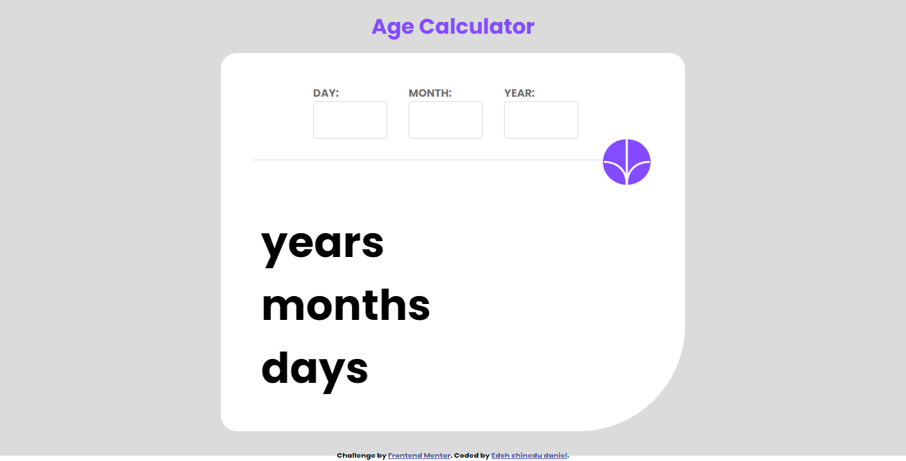

# Frontend Mentor - Age calculator app solution

This is a solution to the [Age calculator app challenge on Frontend Mentor](https://www.frontendmentor.io/challenges/age-calculator-app-dF9DFFpj-Q). Frontend Mentor challenges help you improve your coding skills by building realistic projects.

## Table of contents

- [Overview](#overview)
  - [The challenge](#the-challenge)
  - [Screenshot](#screenshot)
  - [Links](#links)
- [My process](#my-process)
  - [Built with](#built-with)
  - [What I learned](#what-i-learned)
  - [Continued development](#continued-development)
  - [Useful resources](#useful-resources)
- [Author](#author)
- [Acknowledgments](#acknowledgments)

## Overview

### The challenge

Users should be able to:

- View an age in years, months, and days after submitting a valid date through the form
- Receive validation errors if:
  - Any field is empty when the form is submitted
  - The day number is not between 1-31
  - The month number is not between 1-12
  - The year is in the future
  - The date is invalid e.g. 31/04/1991 (there are 30 days in April)
- View the optimal layout for the interface depending on their device's screen size
- See hover and focus states for all interactive elements on the page
- **Bonus**: See the age numbers animate to their final number when the form is submitted

### Screenshot



### Links

- Solution URL: [Add solution URL here](http://127.0.0.1:5500/index.html)
- Live Site URL: [Add live site URL here](https://your-live-site-url.com)

## My process

### Built with

- Semantic HTML5 markup
- CSS custom properties
- Flexbox
- vanila js

### What I learned

.how to use DateTime Object,
.how to style html from js

```html
<h1>Some HTML code I'm proud of</h1>
```

```css
:root {
  --Purple: hsl(259, 100%, 65%);
  --LightRed: hsl(0, 100%, 67%);
  --White: hsl(0, 0%, 100%);
  --OffWhite: hsl(0, 0%, 94%);
  --LightGrey: hsl(0, 0%, 86%);
  --SmokeyGrey: hsl(0, 1%, 44%);
  --OffBlack: hsl(0, 0%, 8%);
  --fz: 2em;
  --ff: "Poppins", sans-serif;
  --fw400: 400;
  --fw700: 700;
  --fw800: 800;
}
```

```js
const proudOfThisDateObj = () => {
  // Create a Date object from the inputs
  const dob = new Date(yearInput, monthInput - 1, dayInput);
  const currentDate = new Date();

  // Calculate the age difference in milliseconds
  const ageDiff = currentDate - dob;

  // Convert milliseconds to years, months, and days
  const millisecondsPerDay = 24 * 60 * 60 * 1000;
  const years = Math.floor(ageDiff / (millisecondsPerDay * 365));
  const remainingDays = ageDiff % (millisecondsPerDay * 365);
  const months = Math.floor(remainingDays / (millisecondsPerDay * 30));
  const days = Math.floor(
    (remainingDays % (millisecondsPerDay * 30)) / millisecondsPerDay
  );
};
```

### Continued development

would like to use react for my next challenge and also using css framework for styling

### Useful resources

- [stackoverflow](https://stackoverflow.com/questions/11563638/how-do-i-get-the-value-of-text-input-field-using-javascript) - helped me on how to get number that a user enter in an input. i.e: input.value.
- [geeksforgeeks](https://www.geeksforgeeks.org/how-to-add-html-elements-dynamically-using-javascript/) - helped me on how to append text to my html element from js.

- [chatgpt-3 AI](https://chat.openai.com/) - helped me on create a data type object also created an alogrithm to get user age, month, day.

## Author

- facebook URl - [Edeh chinedu daniel](https://web.facebook.com/edeh.chinedu.7545)
- Frontend Mentor - [@Edehchi59](https://www.frontendmentor.io/profile/Edehchi59)
- Twitter - [@EdehChinedu20](https://twitter.com/EdehChinedu20)

## Acknowledgments

My thanks goes to stackoverflow, geeksforgeeks for helping me out on how to get input value in js.
regards to chat-gpt3 AI
